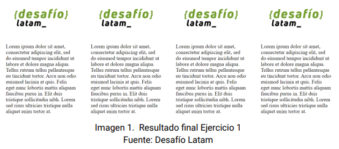

## Ejercicio 1

Este ejercicio requiere que dentro de un contenedor coloque 4 `<section>` cada uno con un ancho de 25% evitando el desbordamiento. No entrega sugerencias de cómo realizarlo, sólo pide obtener el resultado. En el código hay 3 soluciones de muchas posibles que no incluyen el uso de valores de `position` distintos a static, pero una de ellas si usa la propiedad `float`. Básicamente se investiga en el espaciado que existe entre los elementos `inline`, feature totalmente razonable desde un punto de vista editorial.  

**Modelo:** 

 
