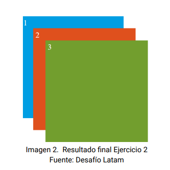

## Ejercicio 2

En este ejercicio hay que posicionar lo que parecen 3 elemento de tipo `block` en capas superpuestas. Da la impresión de que es para utilizar z-index pero el ejemplo muestra los elementos tal como aparecerían en el _stacking context_ normal. Se podría lograr simplemente con position relative, pero luego sería un ejercicio aburrido porque el próximo si requiere uso de `position: relative/absolute` por lo que se ha optado por invertir el orden de las tarjetas como aparecen en el stacking habitual para mostrar el uso de `z-index`

**Modelo:** 

 
