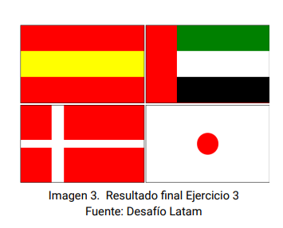

## Ejercicio 3

Este ejercicio es muy simpático, sirve para trabajar `position: relative/absolute` Simplemente hay que imitar la imagen de abajo. No requiere mucha explicación. Se ha utilizado `position: relative` en el parent general y `position: absolute` a los child intermedios que hacen de punto de referencia para los elementos interiores de cada bandera. Tenía un error de concepto respecto a `relative` que he corregido y voy a rescatar acá. `relative` es simplemente relativo a si mismo. El punto de referencia es el punto donde el elemento habría aparecido en _normal flow_  

**Modelo:** 

 
